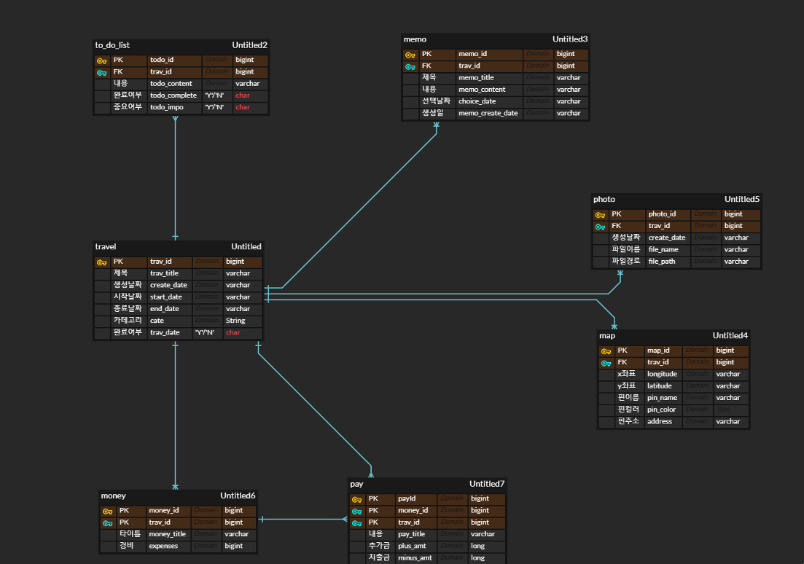
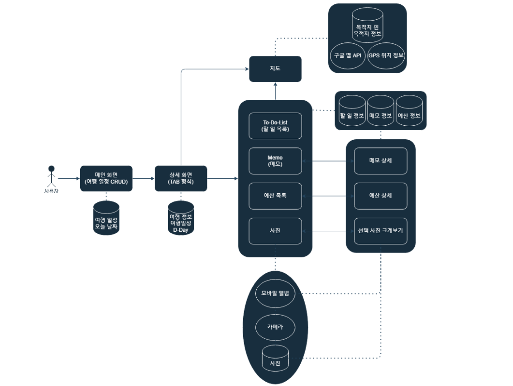

# ✈️ InTravel
여행속으로 안드로이드 앱 프로젝트

# 📝 프로젝트
> 개발기간 : 2024.09.03 ~ 2024.09.13

# 👥 개발인원
> 5명

# 💻 담당역할
> 여행관리,지출관리 부분 서버 DB 구현

# 👩‍💻 Skills
1. 백엔드
>

2. 프론트엔드
>

# 📚 ERD & USE-CASE

ERD

USE-CASE

# 주요기능
1.
> 여행 예정 활동,필요한 물건 등을 생성하고 관리 할 수 있습니다.  
중요도가 높은 항목은 별표 모양으로 표시가 가능하고 별표 모양을 활성화하면 리스트 최 상단으로 이동합니다.  
여행 일정이 끝나 디데이가 지난 항목은 디데이 관리 페이지의 메모 기능을 통해 일기처럼 작성하여 기록 할 수 있습니다.  
가계부 기능을 이용하여 지출한 위치 금액을 입력하여 총 지출금액을 확인할수 있으며, 터치시 영수증 형식으로 출력하여 보여줍니다.

2.
> 갤러리 기능을 이용하여 사진을 촬영하여 앱 갤러리에 사진을 저장하여 앨범 형식으로 앱에서 확인이 가능합니다.  
구글 지도를 활용하여 주소 검색 기능과 현재 위치를 볼수있는 기능을 구현하였고 핀 컬러와 이름을 작성하고 생성하여 목적지를 저장 가능 합니다.
